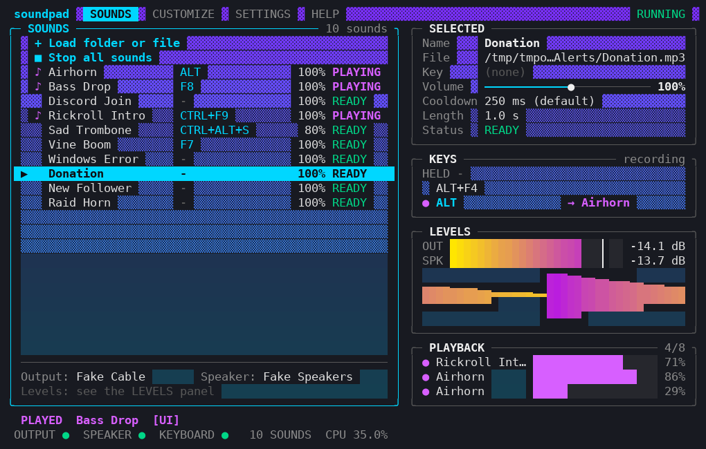
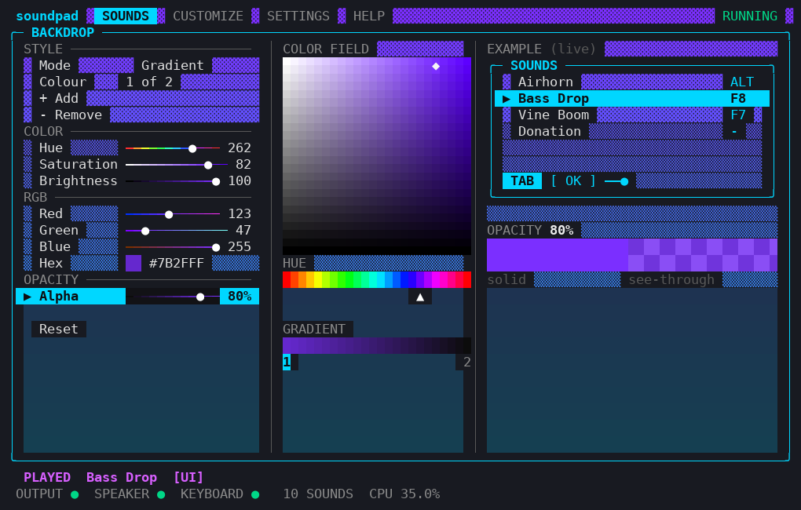

# Soundpad


Soundboard for Windows 10 and 11. It runs in the terminal and keeps working in the background. Your sounds play
into a virtual microphone cable, so Discord, games and OBS hear them, and on your speakers so you hear them too.
A key or key combination triggers a sound in any window, also in a fullscreen game.

The voice changer is a separate project, [Voicer](https://github.com/4ourself/voicer). Both can use the same
cable at the same time.


## Install

Needs Windows 10 or 11 and Python 3.10 or newer ([python.org](https://www.python.org/downloads/), tick
"Add python.exe to PATH").

1. Download the repository (Code, Download ZIP) and unpack it.
2. Double-click **run.bat**.

`run.bat` creates a private `.venv` folder once, installs the libraries only if they are missing, and starts
`main.py`. A normal launch downloads nothing.

Manual start: `pip install -r requirements.txt`, then `python main.py`. Use Windows Terminal, at least 80x24.

## Setup

Soundpad needs two devices. No microphone, no voice effects.

1. Install a virtual cable, for example [VB-Cable](https://vb-audio.com/Cable/).
2. Start Soundpad, press Enter on the title screen. The first run opens a setup screen with the cable and your
   default speakers preselected. Choose **FINISH SETUP**.
3. In Discord, OBS or the game choose `CABLE Output` as the microphone. Turn off automatic input sensitivity.


| Device | Meaning |
|--------|---------|
| Output | the virtual cable (`CABLE Input`) |
| Speaker | your headphones or speakers |

## Controls

| Key | Action |
|-----|--------|
| Up / Down | move |
| Left / Right | change a value, Right opens a sound's editor |
| Enter | switch on or off, confirm, play the selected sound |
| Backspace | go back |

Hold Left or Right to change sliders faster.

## Loading sounds

Sounds, then **+ Load folder or file**. Paste a path and press Enter. The field says FOLDER, FILE or NOT FOUND
while you type. Quotes from "Copy as path" are fine, Tab completes paths.

 

- A folder loads all audio files in it and its subfolders (can be turned off in Settings).
- All common audio formats work: wav, mp3, ogg, opus, flac, aiff, m4a, aac, wma, webm and audio in mp4 or mkv.
- Loaded folders are scanned again at every start. New files appear, your keys and volumes stay.
- Long files are streamed from disk. Everything else is decoded at start for instant playback.

## Sounds screen

One row per sound with key, volume and state. Enter plays it. **Stop all sounds** fades everything out.
On the right: details, the live KEYS panel, levels with a waveform, and playback progress.


It also fits the minimum size of 80x24.


## Keys

Soundpad listens to all key presses system-wide, so sounds work while you are in a game or another program.

- A single key (`F7`, `NUM1`, `ALT`) or a combination (`CTRL+ALT+S`).
- Keys are never blocked. Windows and the game still get every key press.
- **Set a key:** open the sound's editor with Right, select **Key**, press Enter, press the key.
- **Remove a key:** select **Key**, press Enter, then Enter or Backspace again. It shows `[ none ]`.
  Escape cancels. Because of this, Enter or Backspace alone cannot be a sound key, `CTRL+ENTER` can.
- **Backspace** in the editor saves your changes and goes back. **CANCEL** discards them.
- A **Stop-all key** fades out everything. **Repeat while held** retriggers a held key.
- A sound on `ALT` plays when Alt goes down, so Alt+F4 plays it too. Turn on Settings > Keyboard >
  "Single keys ignore modifiers" to avoid that.


## Sound editor

Name, Key, Volume (0 to 200 percent), Cooldown, Remove. Removing asks first and never deletes the file.

 

## Settings

| Page | Contains |
|------|----------|
| Audio | hear sounds on the speaker, master volume, speaker volume |
| Devices | output, speaker, refresh, audio system |
| Sounds | maximum sounds at once, overlap, default cooldown, subfolders, loaded folders, preload |
| Keyboard | stop-all key, single keys ignore modifiers, repeat while held, hook status |
| Performance | buffer 10 to 40 ms, sample rate, estimated latency |
| Interface | characters, refresh rate |
| Config | export and import |

  

## Help and signal check

**Signal check** follows a sound through the chain and says where it stops: output not open, a normal device
instead of a cable, speaker missing, key hook not running, sounds that cannot be decoded, volume at 0.

 

## Customize

In the main menu. Everything applies at once and is saved.


### Colors

Main color and volume graph colors can be a solid color, a gradient of 2 to 4 colors, or animated rainbow.
Controls: hue, saturation, brightness, RGB, hex and alpha.

 
 
 

### Backdrop and blur

| Backdrop | Result |
|----------|--------|
| terminal | nothing is painted, the Windows Terminal blur stays (default) |
| glass | your color is laid over the blur, alpha sets how much of the blur shows |
| custom | solid painted background, hides the blur |

A terminal cannot mix a cell color with the desktop, so `glass` uses shade characters to let the blur show
between them. If gradients look banded, set Color mode to `true`.

 
 


The screenshots have no real blur behind them.

### Layout

Graph position and menu position: left, center or right. Borders: rounded or square.

 
 

### Animation

Tab animation: none (default), fade, line, slide, wipe, dissolve, curtain, blinds, random. It only affects
the screen, never the audio.


<details>
<summary>Animation frames</summary>

 
 
 


</details>

### Logo

Title screen on or off, logo glow: sometimes, always or off.

 
 

### Config export and import

Customize > Config. Export saves your look and settings to one JSON file, import loads it. Soundpad and Voicer
share the format, so a look made in one works in the other. Audio devices, loaded folders and sound keys are
never included.

 

## Use with Voicer

Select the same cable as Output in both programs. Windows mixes the two, so Discord hears your voice and your
sounds. Sounds never pass through the voice effects.

## Loud sounds

A look-ahead limiter on the output turns very loud sounds down smoothly instead of clipping them. It adds about
1.5 ms of delay. If a loud sound still sounds cut in Discord, turn off Noise Suppression, Echo Cancellation
and Automatic Gain Control in Discord (User Settings, Voice and Video), they are made for speech.

## Troubleshooting

- **Text from a decoder, or a file does not play.** A damaged file is played as far as it can be decoded. Details
  are in `data/decoder.log`. A file that cannot be read at all shows as an error in the list.
- **No sound in Discord.** Open Help, Signal check. It says where the sound stops.

## Privacy

Soundpad has to see every key press to know when to play a sound. What it does with them:

- Each key is compared with your bindings in memory, nothing else.
- The last 12 presses are kept in memory for the KEYS panel and never written to disk.
- No network code, no telemetry, no update check. Only `pip` downloads the libraries, once.
- Keys are not blocked, changed or injected.
- It writes only to its `data` folder and to files you export.

The whole keyboard side is one file: `soundpad/keybinds.py`.

## Command line

```
python main.py                 start
python main.py --list-devices  list output devices and exit
```

`SOUNDPAD_DATA` changes the data folder.

## Tests

```
pip install -r requirements-dev.txt
python -m pytest -q tests
```

Tests use a fake audio backend and simulated key events, no sound hardware needed.

## License

MIT, see [LICENSE](LICENSE). The logo uses the "Bloody" FIGlet font.
